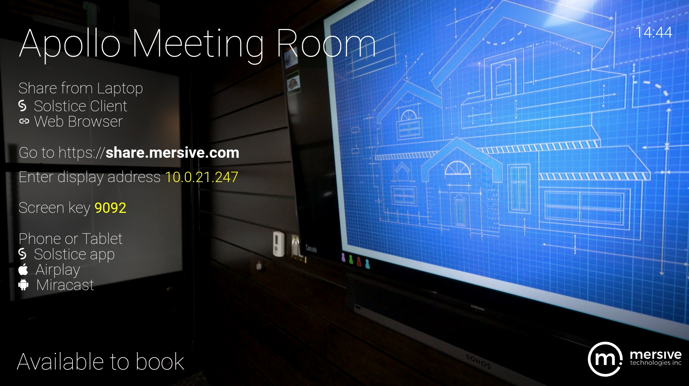
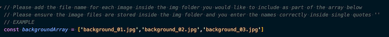
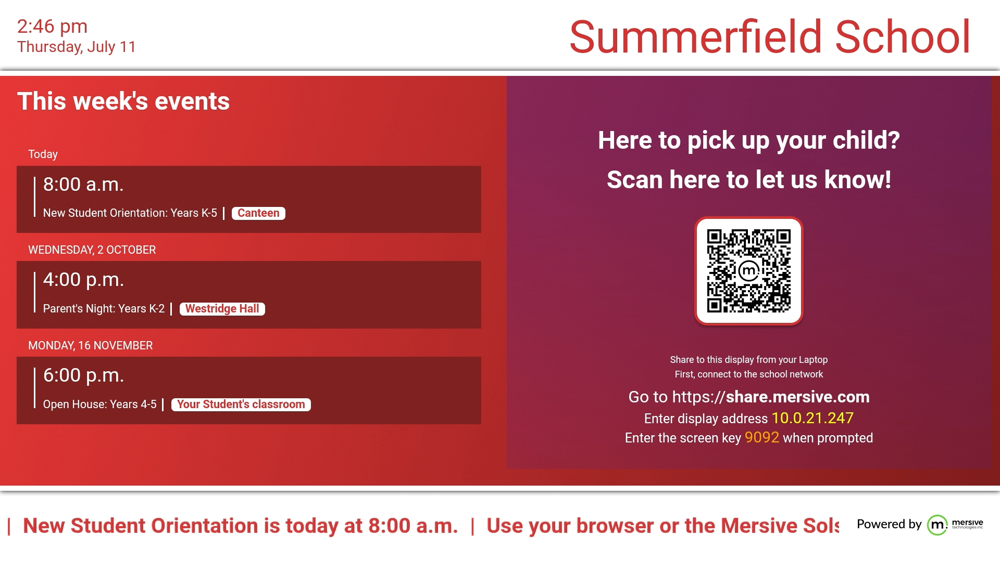

# Solstice Dynamic Digital Signage Examples
## Repository Overview

In Solstice 5.5.2 and higher, Solstice digital signage functionality can be configured to display a customized welcome screen page when the Solstice display is not in use for content sharing. This repository contains examples of some ways this functionality can be used. See directions for using these examples to create dynamic digital signage with Solstice at https://documentation.mersive.com/content/topics/integration-dynamic-digital-signage.htm.

Information is provided below about the examples provided in this repository. These examples are provided as is, and a strong understanding of HTML, CSS, JavaScript, graphics, and web server configuration is recommended for any significant modifications.

## Example 1 - Business Meeting Room

The Business Meeting Room example is a simple digital signage solution with custom imaging in the background to suit brand standards and directions for how to connect to the Solstice display for wireless content sharing.

Files in this example:
 - index.html - HTML file that references app.js and styles.css to create the page layout
 - app.js - JavaScript programming with variables to interact with Solstice and change between multiple backgrounds at a time interval (example set to 60,000 milliseconds, or 1 minute)
 - style.css - Cascading Style Sheet to define colors, spacing, and text attributes
 - icons/ - folder for various icons and logos used in the example
 - img/ - folder for background images used in example **IMPORTANT NOTE: Do not delete or replace transparent_overlay.png**

### Example background image array

To add background images to the array:
 1. Replace and/or add images to img/ folder.
 2. Add the names of all background images to be rorated through to the `backgroundArray` variable.

## Example 2 - Message Board

The Message Board example displays a split screen with informational text messages on one side and a QR code with custom directions for connecting with the Solstice screen key on the other.

Files in this example:
 - index.html - HTML file that references app.js and styles.css to create the page layout
 - app.js - JavaScript programming with ticker function and variables for Solstice display, organization, and messages
 - style.css - Cascading Style Sheet to define colors, spacing, and text attributes
 - images/ - folder for footer and QR code images

