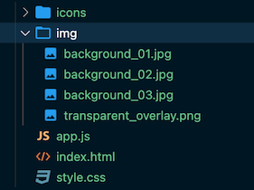

# 
Solstice Digital Signage Examples

## 
Overview

Below are instructions for using any of the examples provided in this repository.
 
To deploy one of the examples, there are a few recommended changes that will be listed by example below.
 

Which ever example you choose, you will want to copy all of the files from the respected folder before making any changes. This will ensure you have a clean backup to revert to.

## 
Example 1 - Business Meeting Room

This example is a simple digital signage solution that allows for custom imaging in the background to suit brand standards without losing the funcitionality of how to connect to the display for wireless sharing.

Below we will outline how to change the background images and where to do that.

## Manage background images:
## IMPORTANT NOTE: Do not delete or replace transparent_overlay.png

This web application has the functionality to change between multiple backgrounds at a time interval set by the moderator. 
To set the time interval, you must change the variable inside the app.js file named backgroundChangeTimer. This is currently set to 60000 milliseconds, which equals 1 minute. Reminder: every 1000 milliseconds equals 1 second. 

You can also replace or add to the included background images provided. To do this, you will want to add your images to the img folder.
 

 

Once you have placed the desired images into the proper folder, we then want to add the file names to the app.js file. This is done by modifying the backgroundArray variable. Ensure the array only contains the names of the files in the img folder that you would like to have displayed as the background.
If you do not wish to have the background images change, simply include a single file name in the array. Below is an example image of the array.
 

## Manage company logo:

## 
Example 2 - Message Board

